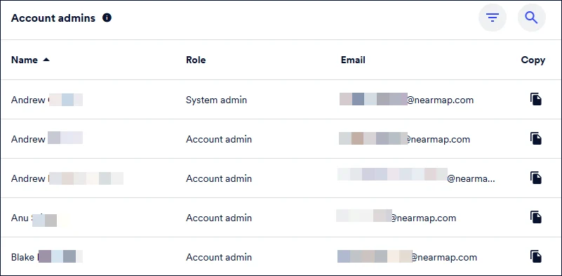

# Nearmap User

### Access your company's Nearmap subscription

Before you can use Nearmap, your organization's Nearmap administrator needs to invite you. Once they send an invitation, you'll receive an email from Nearmap. Click **Accept Invitation** in that email, complete the invitation form, and you're in. If you're not sure whether you already have an account, go to the [password reset page](https://help.nearmap.com/home/leaving?allowTrusted=1\&target=https%3A%2F%2Fadmin.nearmap.com%2Fpassword%2Fforgot) and enter your work email address. If an account exists, you'll receive a reset link. If you don't receive anything, you don't yet have an active account and will need to ask your administrator to invite you.

If you're unsure who your administrator is, you can [view your account administrators](https://help.nearmap.com/kb/articles/931-view-your-account-administrators) from within MyAccount once you're logged in. For full details on this process, see [Access My Company's Nearmap Subscription](https://help.nearmap.com/kb/articles/647-access-my-companys-nearmap-subscription).

<figure><figcaption></figcaption></figure>

### Log in and set up your profile

Once you have an account, [log in to MyAccount](https://help.nearmap.com/kb/articles/1663-log-in-to-myaccount) using your Nearmap credentials, or follow the [First Time Login](https://help.nearmap.com/kb/articles/1599-first-time-login) guide if this is your first session. From MyAccount, you can access your [User Dashboard](https://help.nearmap.com/kb/articles/649-user-dashboard), which gives you a personal overview of your account activity. It's worth taking a few minutes to [edit your personal details](https://help.nearmap.com/kb/articles/651-edit-personal-details) and [manage your Nearmap profile](https://help.nearmap.com/kb/articles/126-manage-your-nearmap-profile) so your account reflects your current role and contact information. If you ever need to update your login credentials, you can [update your email address](https://help.nearmap.com/kb/articles/652-update-your-email-address) or [change your password](https://help.nearmap.com/kb/articles/653-change-your-password) directly from your profile settings. Should you ever get locked out, the [Reset Your Password](https://help.nearmap.com/kb/articles/1598-reset-your-password) guide walks you through the recovery process.

### Understand what you can access

Your access to Nearmap products depends on the permissions your administrator has configured for your account. Depending upon your subscription you may have access to [MapBrowser](https://help.nearmap.com/kb/articles/132-about-mapbrowser), giving you immediate access to high-resolution vertical imagery, historical surveys, measurement tools, and export features. Additional products such as Advanced Export and GeoData Link require your administrator to explicitly grant you access. If you can't see a product you expect to have, reach out to your administrator.

To understand the full range of content types available to you across vertical, oblique, 3D, and AI, see [Getting Started with Nearmap Content](https://help.nearmap.com/kb/articles/1930-getting-started-with-nearmap-content). For an overview of how to navigate the MyAccount interface as a user, refer to [About MyAccount](https://help.nearmap.com/kb/articles/122-about-myaccount).
