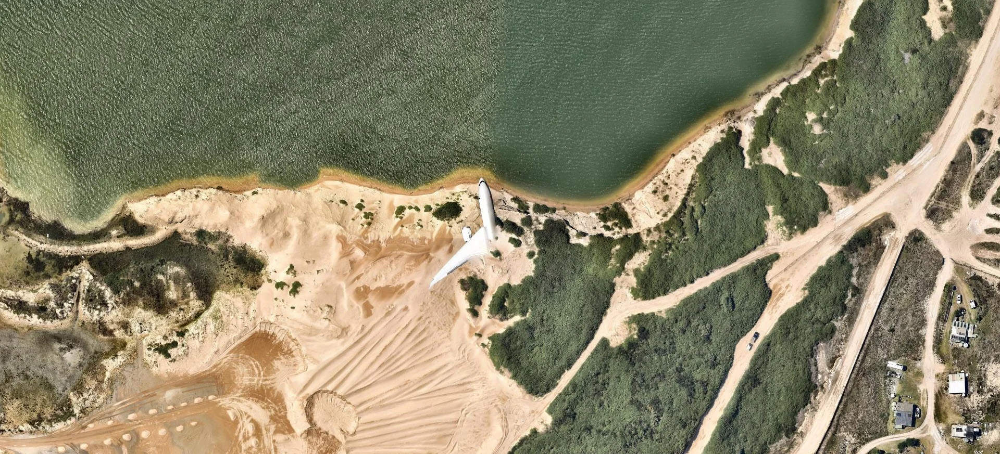

# Our Top Troubleshooting Tips

<figure><figcaption></figcaption></figure>

Here are some of the most common issues our users encounter.

### General

#### Is Nearmap down?

Nearmap reports the health of all our production systems on our **Service Status page**: [https://www.nearmap.com/au/status](https://help.nearmap.com/home/leaving?allowTrusted=1\&target=https%3A%2F%2Fwww.nearmap.com%2Fau%2Fstatus)

The Status page includes:

* details of any incidents with our production services
* regular updates on any production incidents until they are resolved
* announcements of any planned maintenance activities

We encourage you to subscribe to updates on our status page so that you receive an email for all updates on production incidents and planned maintenance. To subscribe for updates, click **SUBSCRIBE** at the top of the status page.

#### What's my UTM zone?

To identify your UTM zone, follow this link: [https://mangomap.com/robertyoung/maps/69585/what-utm-zone-am-i-in-#](https://help.nearmap.com/home/leaving?allowTrusted=1\&target=https%3A%2F%2Fmangomap.com%2Frobertyoung%2Fmaps%2F69585%2Fwhat-utm-zone-am-i-in-)

### MapBrowser

#### My MapBrowser images are darker compared to other users'

MapBrowser images can be dark for one of the following reasons:

1. If the Boundaries or Roads Overlay layers is enabled.
2. If the background is set to more than "0".

#### My location search is not returning a result

When you are searching for an address, the search tool does not provide any suggestions or results if the URL `*.api.here.com`  is blocked. Check with your IT team if the site is blocked by a firewall or anti-virus software.

#### My MapBrowser are icons showing up as text

This occurs when the following URLs are blocked by your firewall or an anti-virus software:

* `*.gstatic.com`
* `*.googleapis.com`

Check with your IT team if these sites can be added to your network's whitelist or be unblocked.

### Contact Support

Not able to find an answer in our documentation to resolve your issue? Submit your query as a **support request** by clicking the button below. Our support team will get in touch with you.

[Submit a support request](https://help.nearmap.com/home/leaving?allowTrusted=1\&target=http%3A%2F%2Fwww.nearmap.com%2Fcontact-support)

Our support hours are:

* 9am - 5pm AEDT
* 9am - 5pm MST
